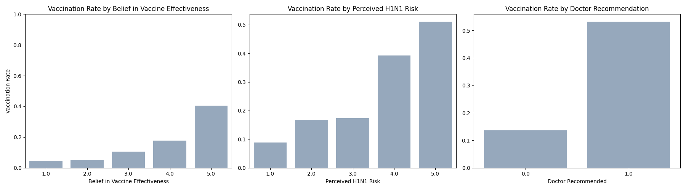
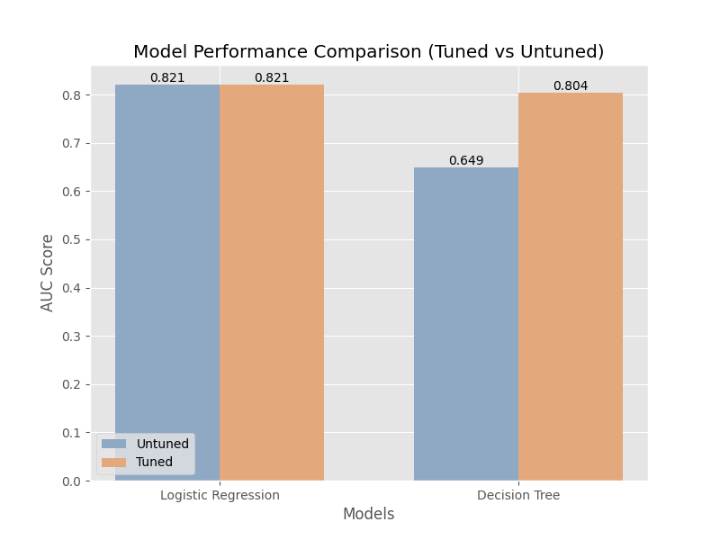
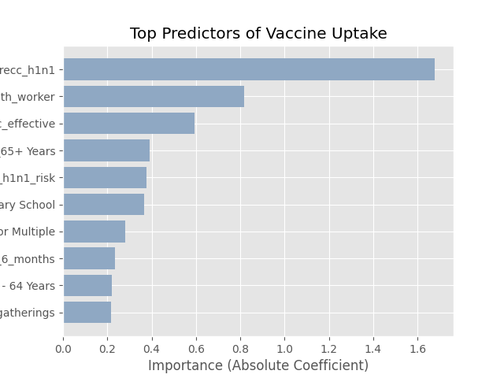

# 🦠 H1N1 Vaccination Prediction Project

---

## 📌 1. Project Overview
This project predicts whether individuals received the H1N1 flu vaccine using data from the **National 2009 H1N1 Flu Survey**.

The goal is to build a **binary classification model** that estimates the probability of vaccination based on:
- Demographics  
- Health behaviors  
- Public perceptions  

---

## 🎯 2. Business Understanding

Vaccination is an important public health tool, but many people do not get vaccinated due to **hesitancy, misinformation, and access issues**.

- **Problem:** Identify people who are likely or unlikely to get vaccinated  
- **Stakeholders:** Public health organizations, policymakers, healthcare providers  
- **Key Question:** What factors most influence vaccine uptake?

---

## 📊 3. Data Description

- **Number of Records:** 26,707  
- **Number of Features:** 38  

**Target Variable:**  
- `h1n1_vaccine`  
  - 0 = Not Vaccinated  
  - 1 = Vaccinated  

**Feature Categories:**
- **Behavioral:** Mask use, hand washing, social distancing  
- **Perceptions:** Vaccine effectiveness, perceived risk  
- **Demographics:** Age, education, race, income  

**Challenges:**
- Missing values in some features (e.g., health insurance, employment)
- Handled using imputation

---

## 🔍 4. Exploratory Data Analysis (EDA)

EDA was performed to understand patterns in the data and relationships with vaccination.

### 📈 EDA Visualization

  

Key observations:
- People who believe the vaccine is effective are more likely to take it  
- Higher perceived risk increases vaccination likelihood  
- Doctor recommendation strongly influences decisions  

---

## ⚙️ 5. Methodology

1. **Data Cleaning**
   - Handled missing values
   - Encoded categorical variables  

2. **Handling Imbalance**
   - Applied **SMOTE** to balance classes  

3. **Modeling**
   - Logistic Regression  
   - Decision Tree  

4. **Hyperparameter Tuning**
   - Used **GridSearchCV** to improve performance  

---

## 📊 6. Model Performance

| Model | AUC Score |
|------|----------|
| Decision Tree (Base) | 0.649 |
| Decision Tree (Tuned) | 0.804 |
| Logistic Regression (Tuned) | **0.821** |

### 📉 Model Comparison

  

👉 Logistic Regression performed best overall.

---

## ⭐ 7. Key Insights (Top Predictors)

The most important factors influencing vaccine uptake:

- Doctor recommendation (strongest predictor)
- Belief in vaccine effectiveness
- Being a health worker
- Age (older individuals more likely)
- Perceived risk of H1N1  

### 📊 Feature Importance Visualization

  

---

## ✅ 8. Conclusions

- Model performance improved significantly after tuning  
- Logistic Regression achieved the highest AUC (0.821)  
- Behavioral and perception-based features are strong predictors  

---

## 💡 9. Recommendations

Based on the model results and feature importance analysis, the following recommendations are made:

1. **Strengthen Doctor Recommendations**  
   The model shows that *doctor recommendation* is the strongest predictor of vaccination. Public health programs should encourage healthcare providers to actively recommend the H1N1 vaccine to patients.

2. **Improve Public Confidence in the Vaccine**  
   Belief in vaccine effectiveness is one of the top predictors. Awareness campaigns should focus on educating people about the safety and effectiveness of the vaccine to build trust.

3. **Target High-Risk and Older Populations**  
   Older age groups and individuals who perceive higher risk are more likely to vaccinate. Campaigns should prioritize these groups while also educating younger populations who may underestimate their risk.

4. **Focus on Low-Uptake Groups Identified by the Model**  
   The model can identify individuals with a low probability of vaccination. These groups should be targeted with tailored messaging and outreach programs.

5. **Use the Model for Decision-Making**  
   The tuned model (Logistic Regression AUC = 0.821) show strong predictive performance. These model can be used to support planning, resource allocation, and targeted interventions.

6. **Continuously Update the Model**  
   Public behavior and perceptions change over time. The model should be retrained regularly with new data to maintain accuracy and relevance.

---

## ▶️ 10. How to Run the Project

### Requirements:
- Python 3.x  
- Jupyter Notebook  

### Libraries:
- pandas  
- numpy  
- matplotlib  
- seaborn  
- scikit-learn  
- imblearn  

### Steps:
1. Open `index.ipynb`  
2. Run all cells  
3. Reproduce results and visualizations  

---

